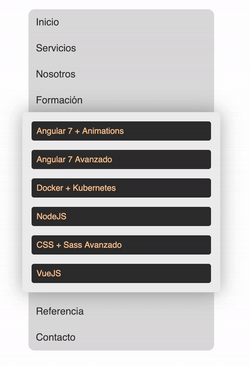
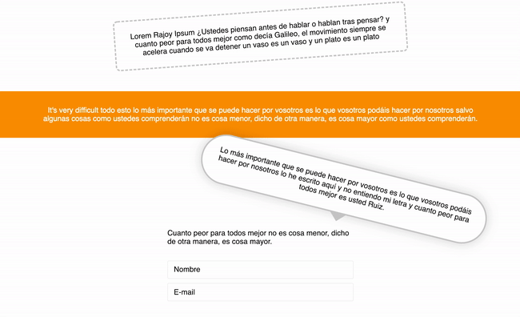
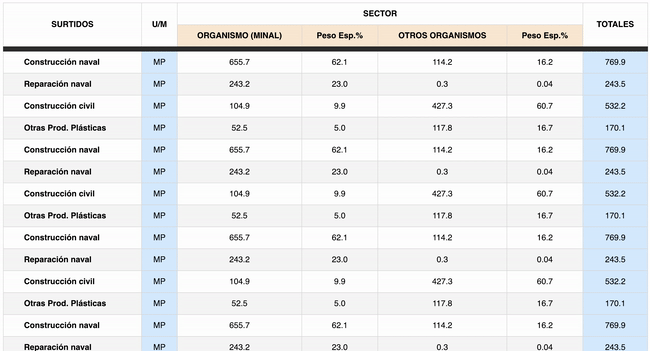

# CSS: selectores avanzados, pseudo-clases y pseudo-elementos

Vamos a realizar tres ejercicios donde practicaremos el uso de los selectores básicos y avanzados, así como las pseudo-clases y los pseudo-elementos.

Los ejercicios consisten en apilcar los selectores correctos en cada regla CSS acorde a lo que indica su enunciado.

**Importante**: se admiten todos tipos de selectores excepto los selectores de clase y de ID, a menos que se indique lo contrario.

## Menú de navegación

En el primer ejercicio vamos a crear un componente que podría ser un menú de navegación. La imagen a continuación muestra el resultado final, de modo que es importante fijarse en todos los detalles con el fin de obtener el mismo resultado.

## Rajoy ipsum

Rendimos homenaje a neustro ex Presidente del Gobierno M.Rajoy con algunas de sus frases célebres recopiladas en [rajoyipsum.com](http://rajoyipsum.com/).

Cada párrafo tendrá su propio estilo, y al final un formulario. La imagen a continuación muestra el resultado final: prestamos atención a todos los detalles.

## Tabla de ventas

En este último ejercicio el reto está en seleccionar el elemento hijo correcto aplicando el número, o la palabra clave o la expresión, correcta.

La siguiente imagen muestra el resultado final, fijémonos en todos los detalles con el fin de obtener el mismo resultado.

